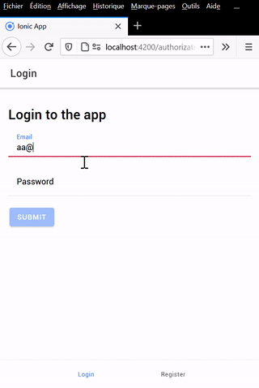

# 🎓  TP - Ionic 2

You will be evaluated on your ability to meet the following 📝 functional goals.

___

### 🐥 Previously

You can create `api` and use `device build`, `modules`, `routing`, `components`, `templates`, `services` and `http` on a thematic you choose.

### 🦆 Now

Before to go further let's enforce `services` and `experience` usage with `loader`.

___

## 👨🏻‍💻 Refactor and experience

**The idea is to provide experience with refactoring our code**

### Guard

* 📝 A Member must be redirected on "contacts/dashboard" when navigate on "authorizations" childs component.

* 📝 A Visitor must be redirected on "authorizations/login" when navigate on "contacts" childs component.

### Error and Loading

<p align="center">
    
</p>

* 📝 The register and login components must provide loading and error messages.

* 📝 When a navigation occurs: the eventual subscription, error and form are reseted.

> 🤔 The idea is the one we speak, maybe a LoadingService can handle boolean attributes for different actions, then before make an http request affect true, after, affect false. You can use this service in templates for display spinner conditionnaly.

### You have the choice between two technical solution:

> You have no hesitation about the first: go to the second solution.

🟢 You must make the loading and error logic job in the `AuthorizationHttpService` using `pipe`, `tap`, `finalize` and `catchError` operator.

🔗[Operators](https://angular.io/guide/rx-library#operators), 🔗[Error handling](https://angular.io/guide/rx-library#error-handling)

🟠 You must make the erro logic job in the `AuthorizationHttpInterceptor`.

🔗 [Interceptor](https://angular.io/guide/http#write-an-interceptor)

The Interceptor must be linked in your feature module, not in app. Some documentative help:

*Features module*

```ts
export class FeaturesModule {

    static forRoot(): ModuleWithProviders<FeaturesModule> {
        return {
            ngModule: FeaturesModule,
            providers: [
                { provide: HTTP_INTERCEPTORS, useClass: FeaturesHttpInterceptor, multi: true },
            ]
        };
    }

}
```

*App module*

```ts
imports: [
    // ...
    FeaturesModule.forRoot(),
    // ...
],
```

Be carefull about your routing, by importing the module directly: the routing will be trigered...

___

## 👨🏻‍💻 Contacts

**The idea is to start new endpoint**

* 📝 As Member I want to see my contact list

* 📝 As Member I want to invit a contact in my contact list

* 📝 As Member I want to remove a  contact in my contact list

* 📝 As Member I want to accept a  contact invitation from my contact list

> Start by create entity scheme, implements an api endpoint then consume it to display the contact list. After that start the endpoint to search and invite a contact. A new job begin.

___

## 🕕 Manage your time

You need to review all we learn to target goals

## 🎯 Let's focus