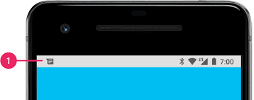
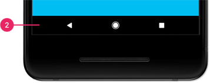

# 🎓  TP - Ionic

You will be evaluated on your ability to meet the following 📝 functional goals.

___

### 🐥 Previously

You can use `device build`, `modules`, `routing`, `components`, `templates` on a thematic you choose.

### 🐥 Now

Before to go further let's enforce `build` and `template` usage with `forms` then define `models`.

___

## 👨🏻‍💻 Build

**The idea is to fix device build issues**

* 📝 The app name, description and author must be customized

> Check config.xml

* 📝 The device status bar must be visible and must have a black background



> Check config.xml and app component

* 📝 The icon and splash screen must be customized

> Check `cordova-res` package and an image editor

* 📝 The splash screen must have a duration of 3 second

> Check config.xml and app component

* 📝 The device navigation bar must have a black background during the splash screen display and app execution (not visible or customizable on all device)

> Check config.xml and right plugin installation



* 📝 The orientation must be set to portrait

> Check config.xml

* 📝 The back device navigation must work

___

🤔 For people who do not have a device, run your project on a configured emulator. If you can't install an emulator with AVD manager on Android Studio: fix your AMD processor issue (patch or hyper-v setting)

```bash
npx ionic cordova run android --emulator
```

___

## 👨🏻‍💻 Forms

**The idea is to implements forms wireframes properly**

* 📝 Templates must be integrated using ion `app`, `router-outlet` and `content` at least

> Check Ionic layout

* 📝 The login component must be implemented using FormBuilder

* 📝 The register component must be implemented using FormBuilder

> Check Angular FormBuilder and Ionic Forms

* 📝 Forms must display errors

> Check Angular FormControl and Validators

* 📝 A Custom matcher must be used to handle password repeat error

> Check Custom Matcher

___

### 🦆 Next

We have displays and need a proper model layout to target your functional goals

___

## 👨🏻‍💻 Models

**The idea is to implements model layout**

* 📝 Define an efficient entity diagram

* 📝 Validate collegialy the diagram

* 📝 Create symfony project without twig and session

* 📝 Create api entities then execute migration

* 📝 Create app models classes at the right places

It will be time to open HTTP thematic and make the app and api communicate to trigger your functional goals using services, guards and storage.

___

## 🕕 Manage your time

You need to review all we learn to target goals

## 🎯 Let's focus