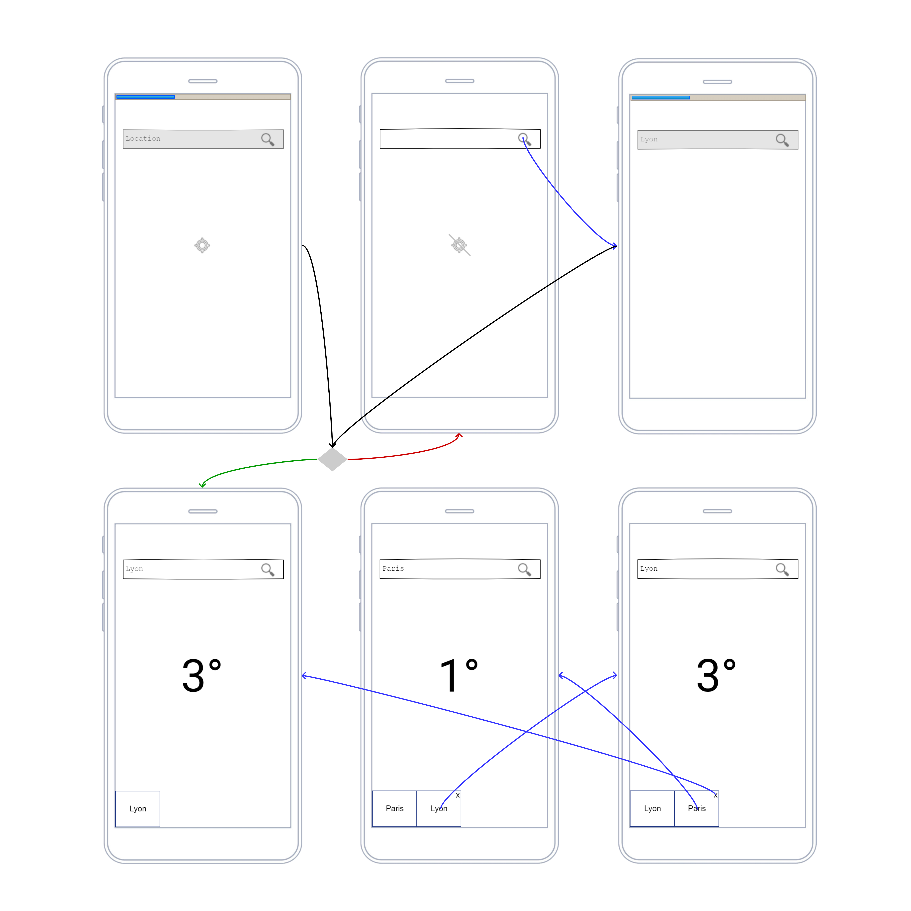

# 🎓  TP 2 - Ionic

You will be evaluated on your ability to meet the following 📝 functional and 📑 technical goals.

___

## 🐥 Previously

You can use modules, components, services, templates, http, logical, routing, ui components on a thematic you choose.

___

## 🦆 Now

Before to go further let's enforce what we already saw and discover cordova plugins.

___

## 🙎‍♂️ Functionnal

* 📝 As user I want to **retrieve** weather for my **current position** so that I'll can check temperature and location name.
* 📝 As user I want to **retrieve** weather for a **location name** so that I'll can check weather for where I want.
* 📝 As user I want to **retrieve** weather for a **location name I already retrieve** so that I'can check my history
* 📝 As user I want to **delete** weather for a **location name I already retrieve** so that I'can manage my history

___

## 👨‍🔧 Technical

* 📑 Geolocation must be retrieved with **Ionic Geolocation**
* 📑 Position weather must be retrieved with **latitude and longitude**
* 📑 Weather feature must be a **routed module**
* 📑 App must master layout **dimension and position**

___

## 💬 Conseil

* Make sure @ionic/cli and cordova is installed on your project when you try to use them to install plusgin and addon
* Determine missing informations on the documentation with error messages
* Use StackOverflow for an error message to debug your provider error
* Stop and start server when you add or remove a module

___

## 🕕 Manage your time

You need to read Ionic documentation and review all we learn to target goals

___

## 🎯 Let's focus