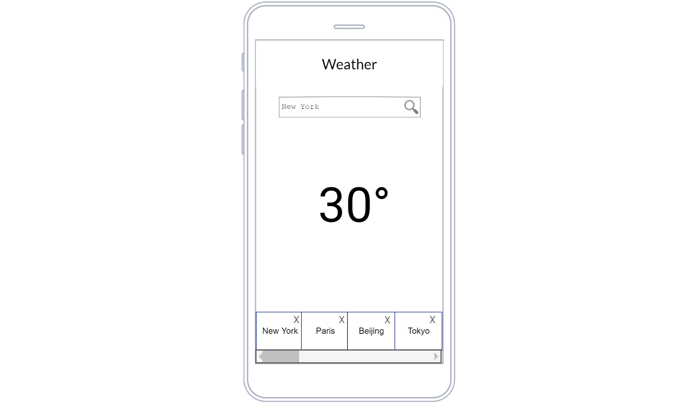
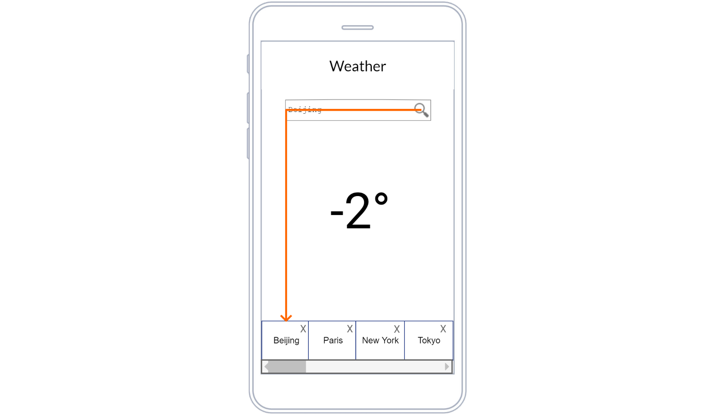
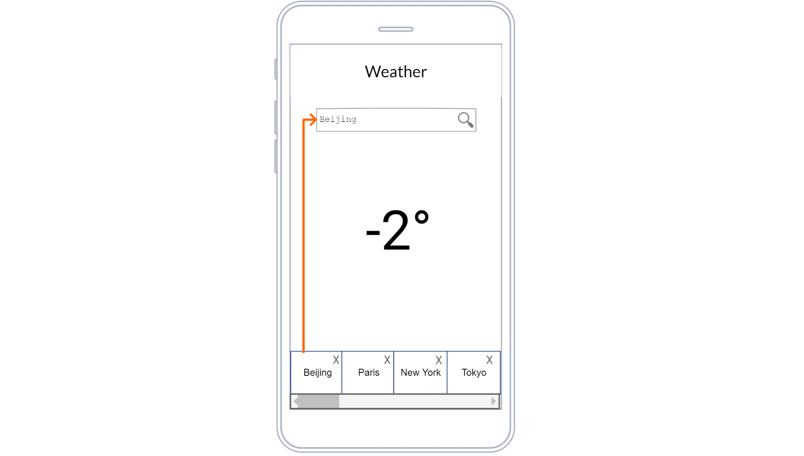

# 🎓  TP - Ionic

You will be evaluated on your ability to meet the following 📝 functional goals.

## 🐥 Previously

We was working on the display of web service data.

> You can use `modules`, `components`, `services`, `templates` on a thematic you choose.

## 🐥 Now

Before to go further let's enforce array usage and what we already saw.

___

### 👨🏻‍💻 Components

🛑 The idea is to create project structure and displays.

> ⚡ A *usefull* package diagram is required

* 📝 As user I want to **retrieve** *prebuilded* weather list for `New York`, `Paris`, `Beijing` and `Tokyo` so that I'll can *select one later*.

* 📝 As user I want to be able to **delete** a prebuilt weather from the list so that I can *customise search history*.

🔗 [@see Angular/wiki](https://github.com/seeren-training/Angular/wiki)

___

### 👨🏻‍💻 Services

🛑 The idea is to make display communication

> ⚡ A *useful* sequence diagram is required

* 📝 As user I want to **add** a weather to the weather list after a search so that I can *have a search history*

* 📝 As user I want to **retrieve** a weather from the list so that I can *choose wheather information*

___

## 🦆 Next

You enforce angular basics, array and service usage. Close this study case, you'll have to perform http feature on it next week probably.

___

### 👨🏻‍💻 Todo List

🛑 The idea is to use http client

* 📝 As user I want to **retrieve** stored todo list so that I can *check what I have todo*

___

## 🕕 Manage your time

You need to review all we learn to target goals

## 🎯 Let's focus